## How to run:

- Install python and then pygame via “pip install pygame” through the
  python console

- Place the main and circle python files together in the same directory

- Run the main file

- A black window should open labelled pygame window

> 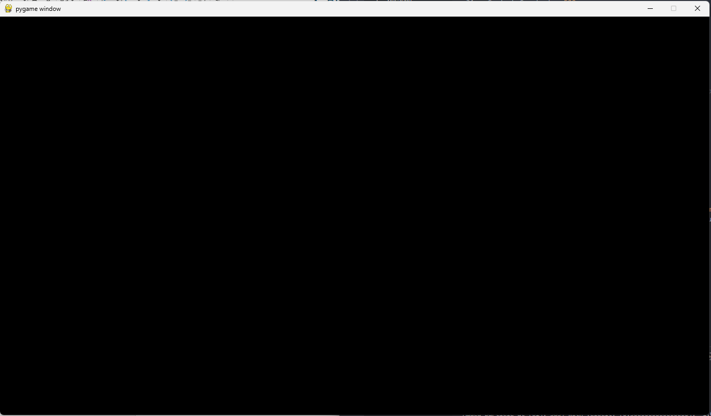 alt="A black screen with a white border AI-generated content may be incorrect." />

## How to use:

Controls are as follows:

- Left mouse click: spawns a proton at the mouse cursor

- Right mouse click: spawns a neutron at the mouse cursor

- Middle wheel click: spawns an electron at the mouse cursor

- C key: clears all particles on the screen

- P key: toggles pause on and off, stops all particles but still allows
  for new ones to be added

- Backspace key: removes the most recently added particle

When spawning a particle you can give it an initial velocity by dragging
the mouse with the button held and it should draw a line as you pull
back showing the magnitude and trajectory that the spawned particle will
follow, originating where the button was initially pressed down

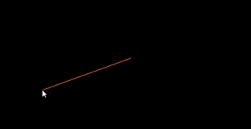

When particles hit the edge of the window they will be teleported to the
opposite side of the window

## Slightly technical explanation (because I’m too lazy to properly comment my code)

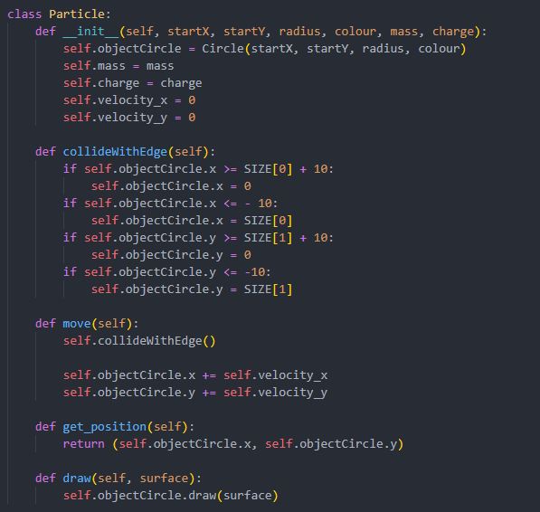Particle
class is the parent class for all the other more specific particles, it
has the functions for edge colliding, applying velocity, returning its
position and drawing itself to the screen.

Each particle has a given mass, size, colour and charge that is then
specified at the child classes of particles

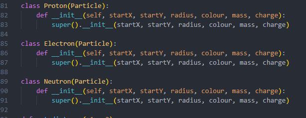

not too much going on here as all functions are inherited from the
parent particle class.

The interesting bit (the maths part):

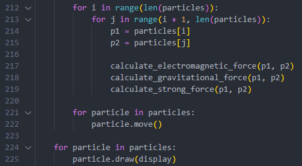first
we loop through every particle and then another loop through every
particle nested within that to find every pair of existing particles

then we can use the calculate forces functions that ill go through in a
moment

then for every particle we call its move function to apply its
calculated force and then drawn them to the screen

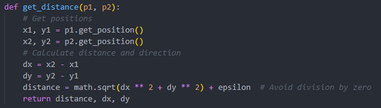First
to begin to calculate the forces between a pair of particles, we need to
know the distance between them  
This function takes the position (from the get_position() function) and
then does some pythag to find the distance between the two points

Next we take this distance and then calculate our forces, for this
simulation ive only included the strong force, electromagnetism and
gravity, (because weak force seems irrelevant to this)

First ill go through the strong force as it’s the strongest..?

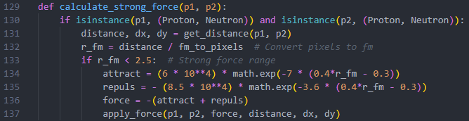So first we check if the two
particles we’re applying the strong force to are both nucleons (proton
or neutron), next we use the get_distance function and then convert it
to femtometers using an arbitrary value that I decided seemed to fit. To
calculate the strong force itself first ive limited the rance to 2.5 fm
just for conveniences sake even though the function itself would account
for that it avoids dealing with tiny decimals that wouldn’t matter
anyway, next I created a pair of exponential functions that tried to
matched the graph of force/distance for the strong force as seen below

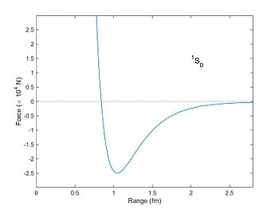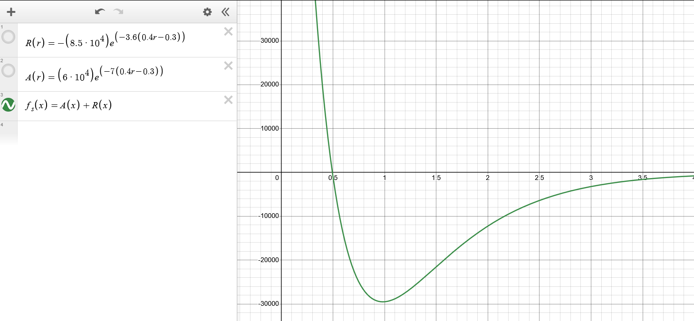as
you can see, its not quite perfect but seeing as I couldn’t find
anything that created the exact curve being just a function of r itll do
for this already arbitrary simulation.

The apply_force() function is then called which I will go through later.

Next ill do the Electromagnetic force

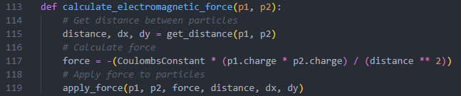this
one is way more basic, uses the same method as the strong force to get
the distance and then applies the formula for electromagnetic
force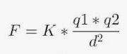:

I have used an arbitrary value for both charge and the coulomb constant
being 10 and 500 respectively as this seemed to be reasonably scaled
with the other forces, although I know this isn’t at all perfect as on
this graph comparing the strong force equation to my em force it doesn’t
at all match other graphs ive seen of the same forces.

The apply force function is then called.

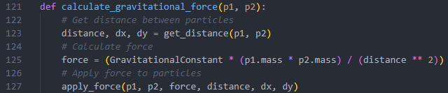Finally
gravity which is almost identical to electromagnetic

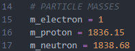The
equation here uses the gravitational constant to be 0.01 and then the
masses are scaled correctly as if the mass of an electron was 1 unit so
slightly less arbitrary than before

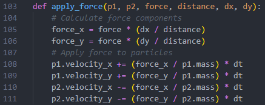Finally,
the apply force function:

Here the force is split into its X and Y components and then uses a
botched version of F= mv/t to calculate the velocity in each direction
for both particles, this is then added to the variable that holds each
particles velocity.

Everything else is just for managing inputs and the particles array so
doesn’t really hold any weight to the overall function of the simulation
and is therefore irrelevant to mention here, I also don’t want to.
